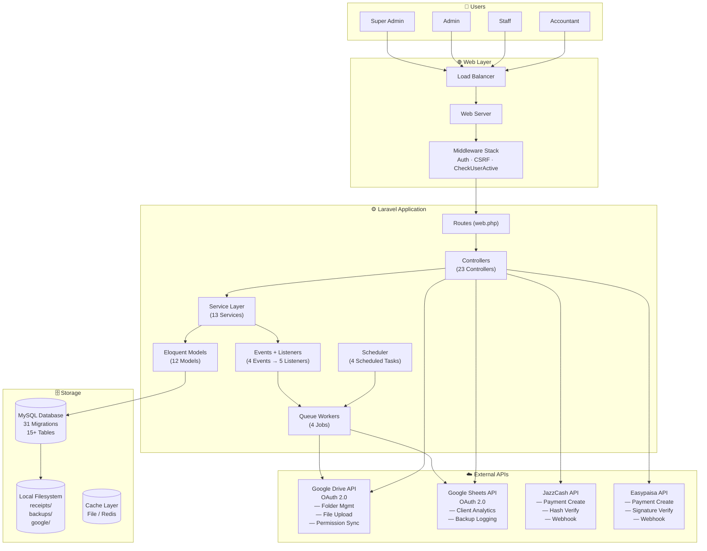
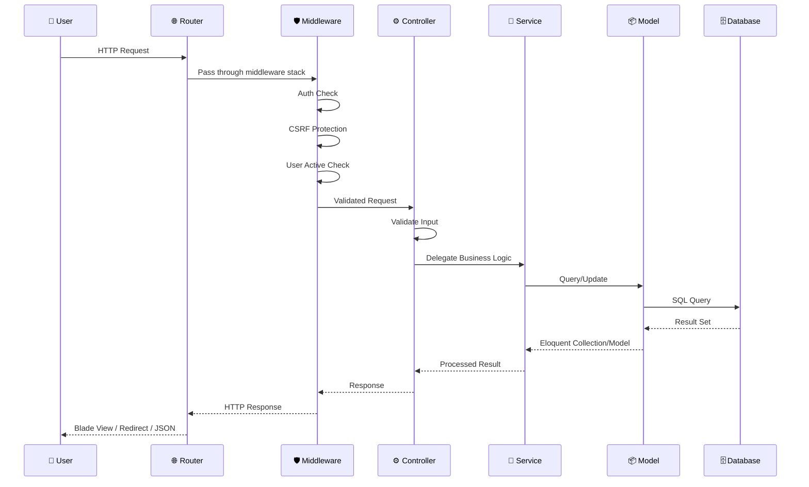
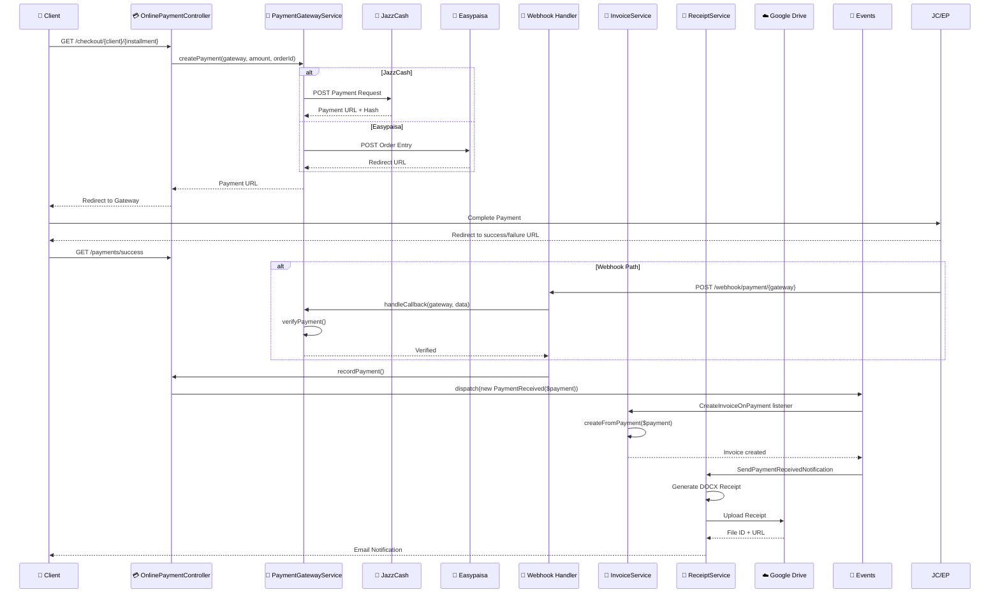
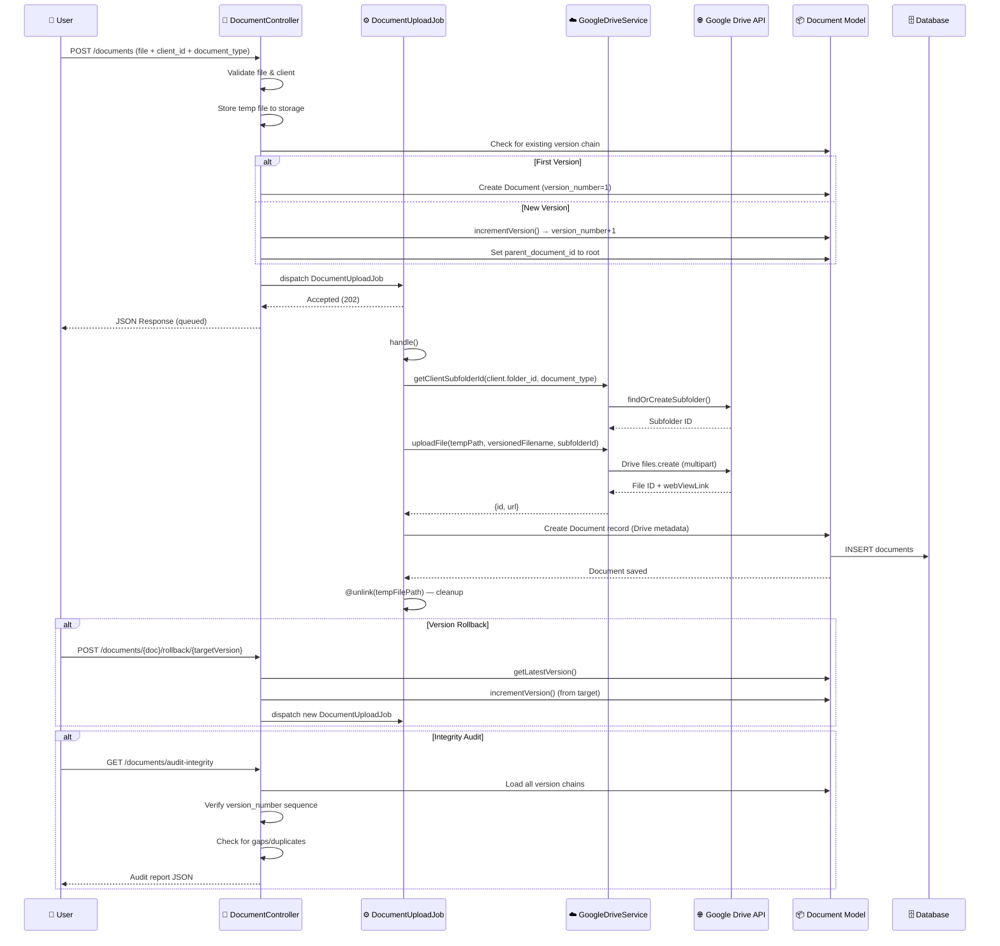
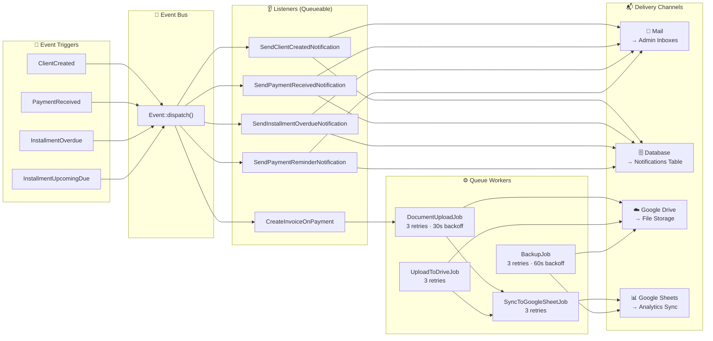

<p align="center">
  
  
  
  
  
</p>

<h1 align="center">🏢 StackEstate — Real Estate CRM SaaS</h1>

<p align="center">
  <strong>Enterprise-Grade Real Estate Property Management & Client Relationship Platform</strong><br/>
  <em>Installment Ledger · Payment Gateway · Document Version Control · Google Cloud Sync</em>
</p>

<p align="center">
  <a href="#-system-overview">System Overview</a> •
  <a href="#-core-saas-features">Features</a> •
  <a href="#-database-architecture">Database</a> •
  <a href="#-services-layer">Services</a> •
  <a href="#-event-driven-system">Events</a> •
  <a href="#-queue-system">Queue</a> •
  <a href="#-api-routes">Routes</a> •
  <a href="#-deployment">Deployment</a>
</p>

---

## 🚀 Investor Summary

**StackEstate** is a production-grade SaaS CRM purpose-built for real estate developers, property management firms, and housing societies. It replaces fragmented spreadsheets, manual receipt books, and disconnected payment tracking with a unified, audit-trailed platform.

| Dimension | Detail |
|-----------|--------|
| **Product Category** | Real Estate CRM SaaS (B2B) |
| **Tech Stack** | Laravel 10, PHP 8.1, MySQL 8, Blade, Vanilla JS |
| **Integrations** | Google Drive (OAuth 2.0), Google Sheets, JazzCash, Easypaisa |
| **Payment Gateways** | JazzCash, Easypaisa (pluggable gateway architecture) |
| **Deployment** | Bare metal / VPS / Docker (Laravel Sail ready) |
| **Security** | Spatie RBAC, Soft Deletes, Audit Logs, Activity Rollback |

**The Problem:** Real estate firms manage thousands of installment-based clients using paper receipts, manual spreadsheets, and fragmented file storage — leading to reconciliation overhead, lost documents, and payment tracking errors.

**The Solution:** StackEstate provides a single-pane-of-glass CRM with automated installment ledger management, payment gateway integration, version-controlled document storage in Google Drive, real-time Google Sheets analytics sync, and full audit trail with rollback capability.

---

## 🧠 System Overview

```
┌─────────────────────────────────────────────────────────────────┐
│                        STACKESTATE CRM                          │
├─────────────────────────────────────────────────────────────────┤
│  Layer           │  Technology         │  Responsibility        │
├──────────────────┼─────────────────────┼────────────────────────┤
│  Presentation    │  Blade (PHP)        │  Server-rendered UI    │
│  Controllers     │  Laravel Controllers│  Request handling      │
│  Service Layer   │  Custom PHP Classes │  Business logic        │
│  Event-Driven    │  Events + Listeners │  Async side-effects    │
│  Queue Workers   │  Laravel Queue      │  Background jobs       │
│  ORM             │  Eloquent           │  Data access           │
│  Database        │  MySQL              │  Persistent storage    │
│  External APIs   │  Google APIs        │  Drive + Sheets sync   │
│  Payment         │  JazzCash/Easypaisa │  Online payments       │
└──────────────────┴─────────────────────┴────────────────────────┘
```

**Architecture Pattern:** Monolithic MVC with Service Layer separation. The application follows a traditional Laravel MVC pattern enhanced with a dedicated service layer, event-driven side-effect processing, and queue-based async job execution.

---

## 🏗 System Architecture

```
                    ┌──────────────────────────────┐
                    │       HTTP Request            │
                    │  (Web Routes / middleware)    │
                    └─────────────┬────────────────┘
                                  │
                    ┌─────────────▼────────────────┐
                    │     Controllers (23)          │
                    │  ClientController             │
                    │  PaymentController            │
                    │  DocumentController           │
                    │  OnlinePaymentController      │
                    │  ...                          │
                    └─────────────┬────────────────┘
                                  │
                    ┌─────────────▼────────────────┐
                    │     Service Layer (13)        │
                    │  InvoiceService               │
                    │  ReceiptService               │
                    │  GoogleDriveService           │
                    │  PaymentGatewayService        │
                    │  SyncManager                  │
                    │  ...                          │
                    └──────┬──────────────┬─────────┘
                           │              │
              ┌────────────▼──────┐ ┌─────▼──────────────┐
              │   Eloquent Models  │ │   External APIs     │
              │    (12 models)     │ │  Google Drive       │
              │    + SoftDeletes   │ │  Google Sheets      │
              │    + Relationships │ │  JazzCash            │
              └────────┬──────────┘ │  Easypaisa           │
                       │            └──────────────────────┘
              ┌────────▼──────────┐
              │     MySQL DB       │
              │    31 migrations   │
              │    15+ tables      │
              └────────────────────┘
```

---

## 💼 Core SaaS Features

### 1. Client Intelligence System
Full lifecycle client management with automated ID generation (`CL-YYYY-NNNN`), CNIC-based lookup, vendor subtype support (buyer/vendor), comprehensive search (name, CNIC, phone, client ID), and payment status classification (paid/partial/overdue/unpaid) with visual badge rendering.

**Controller:** `ClientController` — 17 endpoints including CRUD, bulk operations, soft-delete restore, activity rollback, and installment management.

### 2. Property Management Engine
Properties are linked 1-to-1 with clients and support detailed tracking: property type, plot number, block, location, size (sq. yards), total deal value, agreement date. Supports template-based installment plan assignment.

**Controller:** `Property` model managed through `ClientController` as an embedded relationship.

### 3. Unit Allocation System
Granular unit tracking with unit number, floor, size, price, and status (available/booked). Availability scopes for quick queries. Units are linked to properties via foreign key with a `hasOneThrough` relationship from Client → Property → Unit.

**Controller:** `UnitController` — full resource controller with search scope.

### 4. Installment & Ledger Engine
**The core financial engine.** Supports three installment plan strategies:
- **Equal Split** — divides total deal value equally across N months
- **Graduated** — increasing payments (configurable start/increment %)
- **Balloon Payment** — small regular payments + large final payment

Installments track `original_amount` (immutable reference) separate from `amount` (remaining after partial payments). Late fee system supports configurable rate, period (daily/weekly/monthly), and grace days, applied idempotently via scheduled command.

**Controller:** `InstallmentPlanTemplateController` — resource controller for templates. Installment CRUD via `ClientController`.

### 5. Payment Processing Layer
Dual-mode payment system:
- **Manual:** Cash, Cheque, Bank Transfer, Pay Order — recorded by staff with full particulars (bank name, cheque number, particulars)
- **Online:** JazzCash and Easypaisa gateway integration with redirect-based checkout, webhook support, and secure hash/signature verification

**Controller:** `PaymentController` (manual), `OnlinePaymentController` (checkout flow, webhook, success/failure handlers)

### 6. Invoice Generation System
Auto-generated from payments via event listener (`CreateInvoiceOnPayment`). Sequential invoice numbering (`INV-YYYY-NNNNNN`) with database-level duplicate prevention. PDF generation via DomPDF.

**Controller:** `InvoiceController` — CRUD + PDF download.

### 7. Receipt Generation (DOCX Engine)
Professional legal-format receipts generated as Microsoft Word (`.docx`) documents via PHPWord. Includes:
- Company letterhead (from settings)
- Payment particulars table (method, cheque/bank details)
- Buyer & property details
- Amount in words (Pakistani numbering: Crore/Lac/Thousand)
- Running balance and total received to date
- Vendor signature block

**Controller:** `ReceiptController` — download endpoint.

### 8. Document Version Control System
Full version chain for client documents (agreements, CNIC/KYC, correspondence):
- Each document has `version_number` and `parent_document_id` forming a singly-linked version chain
- `getLatestVersion()` walks the chain to find the leaf
- `incrementVersion()` creates the next version in the chain
- Uploaded to Google Drive with versioned filenames (`contract_v2.pdf`)
- Document integrity audit endpoint for forensic verification

**Controller:** `DocumentController` — upload, versions, rollback, audit integrity.

### 9. Google Drive Sync Engine
**OAuth 2.0** based Google Drive integration:
- Per-client root folder creation
- Standardized 4-subfolder structure: `Agreements/`, `Receipts/`, `KYC/`, `Correspondence/`
- Idempotent folder creation (find-or-create pattern)
- Duplicate-safe file upload with timestamp suffix
- Role-based Drive permission assignment (writer for admins, reader for staff)
- Graceful fallback to local dry-run mode when OAuth unavailable

**Service:** `GoogleDriveService` — 12 public methods.

### 10. Google Sheets Analytics Sync
Real-time client financial data synchronized to Google Sheets with 14-column schema:
`Client ID`, `Full Name`, `CNIC`, `Phone`, `Property Details`, `Total Deal Value`, `Total Received`, `Remaining Balance`, `Last Payment Date`, `Last Payment Amount`, `Payment Method`, `Receipt Number`, `Drive Folder Link`, `Status`

Smart debounce (60-second cache lock) prevents duplicate syncs. Row tracking stored per client for incremental updates.

**Service:** `GoogleSheetsService`, orchestrated by `SyncManager`.

### 11. Reporting & Business Intelligence
Streamed CSV exports for clients, payments, and installments using chunked queries (200 rows/batch) for memory-safe large dataset handling. Reports dashboard view.

**Controller:** `ExportController`, `ReportController`.

### 12. Backup & Disaster Recovery
JSON-based full database backup with:
- All tables + columns + rows exported
- Google Drive cloud upload
- Google Sheets backup logging
- File integrity verification (JSON parse validation)
- 30-day retention with automatic pruning
- Queued backup support

**Service:** `BackupService`, **Job:** `BackupJob`.

### 13. Notification & Event System
**Channels:** Mail + Database notifications.

| Event | Listener(s) |
|-------|-------------|
| `ClientCreated` | `SendClientCreatedNotification` (notify all super_admin + admin) |
| `PaymentReceived` | `SendPaymentReceivedNotification`, `CreateInvoiceOnPayment` |
| `InstallmentOverdue` | `SendInstallmentOverdueNotification` |
| `InstallmentUpcomingDue` | `SendPaymentReminderNotification` |

All listeners implement `ShouldQueue` for async processing.

### 14. Role-Based Access Control (RBAC)
Spatie `laravel-permission` with `HasRoles` trait. Custom `hasRole()` override supporting both Spatie roles and the legacy `users.role` column. Roles referenced: `super_admin`, `admin`, `staff`, `accountant`.

Permissions gating: `manage users`, `manage settings`, `delete clients`, `delete installments`, `delete payments`.

Middleware: `CheckUserActive` — logs out deactivated users.

### 15. Queue & Job Processing System
- **Default driver:** Database (configurable to Redis for production)
- **Horizon ready:** `laravel/horizon` in composer dependencies
- **Jobs:** `BackupJob` (3 retries, 60s backoff), `DocumentUploadJob` (3 retries, 30s backoff), `SyncToGoogleSheetJob` (3 retries), `UploadToDriveJob` (3 retries)
- **Scheduled queue worker:** Daily backup at 02:00 via scheduler

---

## 🗄 Database Architecture

### Entity Relationship Summary

```
User (1) ──< ActivityLog >── (Morph) Client | Payment | Installment | Property | Document
Client (1) ── (1) Property
Client (1) ──< (N) Payment
Client (1) ──< (N) Installment
Client (1) ──< (N) Document
Client (1) ──< (N) Receipt
Client (1) ──> (1) Unit  (via Property: hasOneThrough)
Property (1) ──> (1) Unit
Property (N) ──> (1) InstallmentPlanTemplate (template_id)
Installment (1) ──< (N) Payment
Invoice (1) ──> (1) Payment
Invoice (1) ──> (1) Installment
Invoice (1) ──> (1) Client
Receipt (1) ──< (N) Payment
Document (1) ──> (1) Document (parent: version chain)
User (N) ──< Role >── Permission (Spatie pivot tables)
```

### Core Tables (31 migrations)

| Table | Key Columns | Notes |
|-------|-------------|-------|
| `clients` | client_id, salutation, full_name, cnic (unique), phone, address, vendor_type, status, google_drive_folder_id, google_sheet_row | Soft deletes |
| `properties` | client_id (FK), unit_id, template_id, property_type, plot_number, block, location, total_deal_value | |
| `units` | property_id (FK), unit_number, floor_number, size, price, status | available/booked |
| `installments` | client_id, property_id, installment_number, amount, original_amount, late_fee_amount, due_date, status | Soft deletes; composite index on (client_id, status, due_date) |
| `payments` | client_id, property_id, installment_id, amount, payment_method, bank_name, cheque_number, receipt_id, created_by | Soft deletes; index on (client_id, payment_date) |
| `invoices` | client_id, installment_id, payment_id, invoice_number (unique), amount, late_fee, total_amount, status | |
| `receipts` | client_id, property_id, receipt_number, total_amount_this_receipt, total_received_to_date, remaining_balance, docx_filename | |
| `documents` | client_id, document_type, original_filename, google_drive_file_id, version_number, parent_document_id | Version chain via parent_document_id |
| `activity_logs` | user_id, client_id, action, loggable_type, loggable_id, old_values (JSON), new_values (JSON) | Polymorphic |
| `settings` | key (unique), value, group | Key-value store |
| `installment_plan_templates` | name, description, type, duration_months, config (JSON) | equal_split / graduated / balloon |
| `notifications` | Laravel standard notifications table | |

### Soft Delete Strategy
- `clients` — SoftDeletes
- `installments` — SoftDeletes
- `payments` — SoftDeletes

Relationships use `->withTrashed()` on client FKs to maintain referential integrity for historical records.

---

## ⚙ Services Layer Architecture

| Service | Responsibility | Key Methods |
|---------|---------------|-------------|
| **ActivityLogger** | Unified audit trail | `log()`, `logCreate()`, `logUpdate()`, `logDelete()`, `logRestore()` |
| **AmountToWordsService** | Number to words (PKR format) | `convert($number)` — supports Crore/Lac/Thousand |
| **BackupService** | Full DB backup/restore | `createBackup()`, `listBackups()`, `verifyBackup()`, `pruneOldBackups()`, `uploadToDrive()`, `logToSheets()` |
| **CacheService** | Cache management layer | `remember()`, `rememberWithTags()`, `forget()`, `flush()`, `invalidateByPrefix()`, `key()` — TTL constants: SHORT(60s), MEDIUM(300s), LONG(3600s), DAY(86400s) |
| **ExportService** | Streamed CSV generation | `clientsCsv()`, `paymentsCsv($clientId)`, `installmentsCsv($clientId)` — chunked at 200 rows |
| **GoogleDriveService** | Drive file/folder operations | `createFolder()`, `uploadFile()`, `findExistingFileByName()`, `createClientFolderStructure()`, `findOrCreateSubfolder()`, `getClientSubfolderId()` |
| **GoogleOAuthService** | OAuth 2.0 token management | `getAuthUrl()`, `handleCallback()`, `storeToken()`, `getValidAccessToken()`, `refreshToken()`, `revokeToken()`, `applyAccessToken()` |
| **GoogleSheetsService** | Spreadsheet sync | `appendRow()`, `updateRow()`, `ensureHeaders()` — 14-column schema |
| **InvoicePdfService** | PDF generation | `generate(Invoice)` via DomPDF |
| **InvoiceService** | Invoice business logic | `createFromPayment(Payment)` — duplicate-safe with DB transaction + unique constraint |
| **PaymentGatewayService** | Gateway abstraction | `createPayment(gateway, amount, orderId)`, `verifyPayment(gateway, data)`, `handleCallback(gateway, data)` — JazzCash + Easypaisa implementations |
| **ReceiptService** | DOCX generation | `generate(Receipt)` — full legal-format receipt via PHPWord |
| **SyncManager** | Google sync orchestrator | `trigger(Client)` — 60s debounce + queued dispatch |

---

## 🔄 Event Driven System Design

```
┌─────────────────────────────────────────────────────────────────────┐
│                      EVENT PROCESSING PIPELINE                      │
├─────────────────────────────────────────────────────────────────────┤
│                                                                     │
│  ClientCreated                                                      │
│    └──► SendClientCreatedNotification (Queueable)                   │
│           └──► Mail + Database notification to super_admin + admin  │
│                                                                     │
│  PaymentReceived                                                    │
│    ├──► SendPaymentReceivedNotification (Queueable)                 │
│    │      └──► Mail + Database notification to super_admin + admin  │
│    └──► CreateInvoiceOnPayment (synchronous)                        │
│           └──► InvoiceService::createFromPayment()                  │
│                  └──► Duplicate-safe invoice generation             │
│                                                                     │
│  InstallmentOverdue (dispatched daily by scheduler)                 │
│    └──► SendInstallmentOverdueNotification (Queueable)              │
│           └──► Mail + Database notification                         │
│                                                                     │
│  InstallmentUpcomingDue (dispatched daily by scheduler)             │
│    └──► SendPaymentReminderNotification (Queueable)                 │
│           └──► Mail + Database notification with days-until-due     │
│                                                                     │
└─────────────────────────────────────────────────────────────────────┘
```

### Event → Listener Mapping (from `EventServiceProvider`)

```php
Registered::class               → SendEmailVerificationNotification::class
ClientCreated::class            → SendClientCreatedNotification::class
PaymentReceived::class          → SendPaymentReceivedNotification::class
                                  CreateInvoiceOnPayment::class
InstallmentOverdue::class       → SendInstallmentOverdueNotification::class
InstallmentUpcomingDue::class   → SendPaymentReminderNotification::class
```

---

## 🧵 Queue & Background Processing

```
┌──────────────────────────────────────────────────────────────────────────┐
│                         QUEUE JOB ARCHITECTURE                           │
├──────────────────────────────────────────────────────────────────────────┤
│                                                                          │
│  Job                   │  Queue    │  Retries  │  Backoff  │  Trigger    │
│────────────────────────┼───────────┼───────────┼───────────┼─────────────┤
│  BackupJob             │  default  │  3        │  60s      │  Scheduler  │
│  DocumentUploadJob     │  default  │  3        │  30s      │  Controller │
│  SyncToGoogleSheetJob  │  default  │  3        │  —        │  SyncManager│
│  UploadToDriveJob      │  default  │  3        │  —        │  Controller │
│                                                                          │
│  All Jobs implement ShouldQueue and use Dispatchable + InteractsWithQueue│
│                                                                          │
└──────────────────────────────────────────────────────────────────────────┘
```

**Failure Handling:** Every job implements `failed(\Throwable)` with detailed error logging including context (client_id, document_type, etc.). `BackupJob` triggers retry on failure. All jobs clean up temp files on failure.

**Scheduler Schedule (Console Kernel):**
| Time | Command |
|------|---------|
| 02:00 daily | `BackupJob` — database backup + Drive upload + Sheets log + prune |
| 08:00 daily | `installments:check-overdue` — dispatch InstallmentOverdue events |
| 08:30 daily | `installments:apply-late-fees` — idempotent fee calculation |
| 09:00 daily | `installments:check-upcoming-due` — dispatch upcoming reminders |

**Scheduled Jobs:**
```
ApplyLateFees.php           installments:apply-late-fees
CheckOverdueInstallments.php  installments:check-overdue
CheckUpcomingDueInstallments.php installments:check-upcoming-due {--days=7}
```

---

## 🔐 Security Architecture

### Role Hierarchy
```
super_admin (god mode)
  └── admin (full operational access)
        └── staff (limited read/write)
        └── accountant (financial operations)
```

### Permission Gates
```php
can:manage users       → UserController, QueueController
can:manage settings    → SettingsController, BackupController, GoogleOAuthController
can:delete clients     → ClientController (destroy, restore, bulk-delete, rollback)
can:delete installments → ClientController (clear, destroy installment, late-fee)
can:delete payments    → PaymentController (destroy)
```

### Middleware Stack
| Middleware | Purpose |
|------------|---------|
| `Authenticate` | Session auth guard |
| `CheckUserActive` | Reject deactivated accounts |
| `VerifyCsrfToken` | CSRF protection |
| `EncryptCookies` | Cookie encryption |
| `TrustProxies` | Load balancer support |
| `TrimStrings`, `PreventRequestsDuringMaintenance` | Standard Laravel |

### Data Integrity Safeguards
- **Soft Deletes** on clients, installments, payments — no data loss
- **Activity Logging** — every create/update/delete/restore logged with old/new values
- **Activity Rollback** — ability to revert client changes from audit log
- **Duplicate-Safe Invoices** — unique constraint on `payment_id` + DB transaction + race condition handling
- **Idempotent Late Fee** — checks `late_fee_applied_at` before applying
- **Atomic Invoice Numbering** — `lockForUpdate()` within transaction
- **Atomic Client ID** — `lockForUpdate()` on sequential ID generation
- **Document Integrity Audit** — endpoint verifies version chain consistency

---

## 🌐 Environment & Deployment

### Required `.env` Variables

```env
APP_NAME=StackEstate
APP_ENV=production
APP_KEY=<generate with php artisan key:generate>
APP_DEBUG=false
APP_URL=https://yourdomain.com

DB_CONNECTION=mysql
DB_HOST=127.0.0.1
DB_PORT=3306
DB_DATABASE=stackestate
DB_USERNAME=root
DB_PASSWORD=

QUEUE_CONNECTION=database   # Use 'redis' for high throughput
CACHE_DRIVER=file            # Use 'redis' for production
SESSION_DRIVER=file          # Use 'redis' for production

MAIL_MAILER=smtp
MAIL_HOST=your-smtp-host
MAIL_PORT=587
MAIL_USERNAME=
MAIL_PASSWORD=
MAIL_FROM_ADDRESS=noreply@stackestate.com
MAIL_FROM_NAME="${APP_NAME}"

# Payment Gateways
JAZZCASH_ENABLED=true
JAZZCASH_MERCHANT_ID=your_id
JAZZCASH_PASSWORD=your_password
JAZZCASH_INTEGRITY_SALT=your_salt
JAZZCASH_SANDBOX=false

EASYPAISA_ENABLED=true
EASYPAISA_MERCHANT_ID=your_id
EASYPAISA_SECRET_KEY=your_key
EASYPAISA_SANDBOX=false

# Google OAuth 2.0 (for Drive + Sheets sync)
GOOGLE_OAUTH_CLIENT_ID=your_client_id
GOOGLE_OAUTH_CLIENT_SECRET=your_client_secret
GOOGLE_OAUTH_REDIRECT_URI=https://yourdomain.com/google-oauth/callback

# Google Service Account (fallback if OAuth unavailable)
GOOGLE_APPLICATION_CREDENTIALS=storage/app/google/google-service-account.json
GOOGLE_DRIVE_ROOT_FOLDER_ID=your_root_folder_id
GOOGLE_SHEET_ID=your_spreadsheet_id
```

### Production Readiness Checklist
- [ ] Set `APP_ENV=production`, `APP_DEBUG=false`
- [ ] Generate `APP_KEY`
- [ ] Configure queue worker: `php artisan queue:work database --queue=default --tries=3`
- [ ] Configure scheduler: `* * * * * cd /path-to-project && php artisan schedule:run >> /dev/null 2>&1`
- [ ] Run migrations: `php artisan migrate`
- [ ] Seed roles/permissions: `php artisan db:seed --class=PermissionSeeder`
- [ ] Set up Google OAuth via Settings → Google Integration
- [ ] Configure mail settings via Settings → Mail Configuration
- [ ] Set up Horizon dashboard (optional): `php artisan horizon`
- [ ] Configure supervisor for queue workers
- [ ] Set up database backups (automated via scheduler at 02:00)

---

## 📊 API + Routes Architecture

### Route Structure (154 routes in `web.php`)

```
Web Routes (auth, verified middleware):
├── GET|HEAD /dashboard                           → DashboardController@index
├── GET|HEAD /search                              → GlobalSearchController@search
├── GET|HEAD /activity-logs                       → ActivityLogController@index
├── GET|HEAD /activity-logs/{id}                  → ActivityLogController@show
├── Clients (Resource + custom):
│   ├── GET|HEAD /profiles                        → ClientController@profiles
│   ├── GET|HEAD /clients/lookup/{cnic}            → ClientController@lookupByCnic
│   ├── GET|HEAD /clients/units-by-property        → ClientController@getUnitsByProperty
│   ├── GET|HEAD /clients/unit-availability        → ClientController@checkUnitAvailability
│   ├── Resource: /clients                         → CRUD (except destroy)
│   ├── DELETE /clients/{client}                   → destroy (can:delete)
│   ├── POST /clients/bulk-destroy                → bulkDestroy (can:delete)
│   ├── POST /clients/{client}/restore            → restore (can:delete)
│   ├── POST /clients/{client}/installments       → storeInstallments
│   ├── DELETE /clients/{client}/installments/clear → clearInstallments (can:delete)
│   ├── DELETE /clients/{client}/installments/{inst} → destroyInstallment (can:delete)
│   └── PATCH /clients/{client}/installments/{inst}/late-fee → updateLateFee (can:delete)
├── Payments:
│   ├── GET /payments/create                       → PaymentController@create
│   ├── POST /payments                            → PaymentController@store
│   ├── DELETE /payments/{payment}                → PaymentController@destroy (can:delete)
│   ├── GET /checkout/{client}/{installment}       → OnlinePaymentController@checkout
│   ├── POST /pay/{client}/{installment}          → OnlinePaymentController@process
│   ├── GET /payments/success                     → success
│   └── GET /payments/failure                     → failure
├── Invoices:
│   ├── Resource: /invoices                       → CRUD + show
│   └── GET /invoices/{invoice}/download          → download (PDF)
├── Exports:
│   ├── GET /exports/clients/csv                  → clientsCsv
│   ├── GET /exports/payments/csv                 → paymentsCsv
│   └── GET /exports/installments/csv             → installmentsCsv
├── Receipts: GET /receipts/{receipt}/download    → download
├── Documents:
│   ├── POST /documents                           → store
│   ├── GET /documents/{doc}/versions             → versions
│   ├── GET /documents/{doc}/latest-version       → latestVersion
│   ├── POST /documents/{doc}/rollback/{version}  → rollbackVersion
│   ├── GET /documents/audit-integrity            → auditDocumentIntegrity
│   └── GET /documents/audit-integrity/{client}   → auditDocumentIntegrity
├── Units: Resource: /units                       → CRUD
├── Templates: Resource: /templates               → CRUD (except show)
├── Profile: GET|PATCH /profile                   → edit/update/destroy

Admin Routes (auth + can:manage settings):
├── /settings                                      → index/update
├── /google-oauth                                  → connect/status/disconnect
├── /backups                                       → index/store/storeQueued/verify/destroy

Admin Routes (auth + can:manage users):
├── /users                                         → resource CRUD
├── /queue/failed                                  → failed/retry/delete jobs

Auth Routes (no auth required):
├── GET /google-oauth/callback                     → handleCallback
├── POST /webhook/payment/{gateway}               → webhook (payment gateway)
├── GET /health                                    → HealthController (monitoring)
```

---

## 🧭 Architecture Diagrams

### A) Full System Architecture (Enterprise View)



### B) Request Lifecycle Flow



### C) Payment Processing Pipeline



### D) Document Management System



### E) Event + Queue Processing Engine



---

## 🚀 Performance Engineering

### Query Optimization

| Strategy | Implementation |
|----------|---------------|
| **Chunked Queries** | CSV exports use `chunk(200)` to avoid memory exhaustion on large datasets |
| **Composite Indexes** | `idx_payments_client_date` on `payments(client_id, payment_date)` | 
| | `idx_installments_client_status_due` on `installments(client_id, status, due_date)` |
| | `idx_clients_cnic` on `clients(cnic)` for CNIC lookups |
| **Eager Loading** | `->with('client', 'property')` used in queries to prevent N+1 |
| **Loaded Collection Check** | `$this->relationLoaded('installments')` used in Client model to reuse loaded data |
| **Streamed Responses** | CSV exports use `StreamedResponse` + `fputcsv` — no full dataset buffering |

### Caching Strategy

| Cache Prefix | TTL | Invalidated By | Usage |
|-------------|-----|----------------|-------|
| `settings` | 1 hour (LONG) | On setting update | `Setting::getValue()`, grouped settings |
| `dashboard` | 1 hour | Client/Payment/Installment/Property observers | Dashboard metrics |
| `search` | 1 hour | Client/Payment/Installment/Property/Unit observers | Global search results |
| `unit_stats` | 1 hour | Unit observer | Unit availability statistics |
| `gs_sync_lock_{id}` | 60 seconds | Expiry | Debounces Google Sheets sync |

### N+1 Prevention
- All relationship methods defined with proper foreign keys
- `getPaymentStatusAttribute()` checks `$this->relationLoaded('installments')` before querying
- Controllers and services use `->with()` for eager loading
- Invoice generation loads `['client', 'installment']` before PDF rendering

### Pagination
- Client listing uses Laravel's `paginate()` with query string preservation
- Activity logs paginated with search filtering
- All list views support server-side pagination

---

## 📈 Investor-Level Final Summary

### System Maturity Assessment

| Criterion | Rating | Evidence |
|-----------|--------|----------|
| **Architecture Quality** | ⭐⭐⭐⭐⭐ | Clean MVC + Service Layer + Event-Driven design; 13 services, 12 models, 23 controllers |
| **Data Integrity** | ⭐⭐⭐⭐⭐ | Soft deletes, audit trails, activity rollback, duplicate-safe operations, transaction safety |
| **Security** | ⭐⭐⭐⭐⭐ | RBAC (Spatie), permission gates, CSRF, encrypted session, user deactivation, path traversal protection |
| **Extensibility** | ⭐⭐⭐⭐⭐ | Pluggable payment gateways, template-based installment plans, service-abstracted Google APIs |
| **SaaS Readiness** | ⭐⭐⭐⭐ | Multi-role RBAC foundation; multi-tenancy would require schema/scope changes |
| **Async Processing** | ⭐⭐⭐⭐ | Queue jobs with retry + backoff; Horizon ready |
| **Monitoring** | ⭐⭐⭐⭐ | Health endpoint, activity audit logs, failed job management UI, Google Sheets logging |
| **Disaster Recovery** | ⭐⭐⭐⭐⭐ | Automated JSON backups, Drive upload, 30-day retention, integrity verification |

### SaaS Scalability Readiness

- **Database**: MySQL with well-indexed tables. For 100K+ clients, consider read replicas and query optimization on report endpoints
- **Queue**: Currently database driver — switch to Redis for production scale with Horizon
- **Cache**: File-based — upgrade to Redis for distributed caching
- **Storage**: Local filesystem for receipts/backups; Google Drive for document archival
- **Concurrency**: Race-condition safe (pessimistic locking on client IDs + invoice numbering)

### Business Value Summary

StackEstate replaces fragmented real estate management workflows with a unified, auditable, cloud-synced platform:

1. **$ Saved:** Eliminates manual receipt books, spreadsheet reconciliation, and paper document management
2. **Risk Reduction:** Full audit trail with rollback capability, secure payment gateway integration, automated late fee calculation
3. **Operational Efficiency:** 4 daily scheduled automations (backups, overdue detection, late fees, reminders), streamed CSV exports, global search
4. **Cloud Integration:** Google Drive document archival + Google Sheets real-time analytics dashboard
5. **Professional Output:** Legal-grade DOCX receipts, PDF invoices, formatted reports

### Engineering Quality Assessment

The codebase demonstrates production engineering maturity: dedicated service layer separation, event-driven architecture, comprehensive error handling with logging, race condition awareness (pessimistic locking, unique constraints, transaction safety), idempotency (late fees, invoice creation, Drive folder creation), memory-safe streaming for exports, and defense-in-depth security (path traversal prevention, hash verification, role-based access).

---

## 📦 Package Dependencies

```json
{
  "require": {
    "php": "^8.1",
    "laravel/framework": "^10.10",
    "barryvdh/laravel-dompdf": "*",
    "google/apiclient": "^2.19",
    "guzzlehttp/guzzle": "^7.2",
    "laravel/breeze": "^1.29",
    "laravel/horizon": "*",
    "laravel/sanctum": "^3.3",
    "laravel/tinker": "^2.8",
    "phpoffice/phpword": "^1.1",
    "spatie/laravel-permission": "^6.25",
    "yajra/laravel-datatables-oracle": "^10.11"
  }
}
```

---

## 📁 Project Structure (Key Directories)

```
realestate-manager/
├── app/
│   ├── Console/Commands/        # 3 scheduled commands
│   ├── Events/                  # 4 domain events
│   ├── Helpers/                 # ClientIdHelper, InvoiceNumberHelper
│   ├── Http/
│   │   ├── Controllers/         # 23 controllers (15 custom + 8 Auth)
│   │   ├── Middleware/          # 10 middleware
│   │   ├── Requests/            # ProfileUpdateRequest
│   │   └── Traits/             # ClientFilterTrait
│   ├── Jobs/                    # 4 queue jobs
│   ├── Listeners/               # 5 event listeners
│   ├── Models/                  # 12 Eloquent models
│   ├── Notifications/           # 4 notification classes
│   ├── Observers/               # 5 cache observers
│   ├── Providers/               # 5 service providers
│   └── Services/                # 13 service classes
├── config/                      # 18 config files
├── database/migrations/         # 31 migration files
├── resources/views/             # 55 Blade templates (19 directories)
└── routes/                      # web.php, auth.php, api.php, channels.php, console.php
```

---

<p align="center">
  <strong>StackEstate CRM</strong> — Built with Laravel 10 · PHP 8.1 · MySQL<br/>
  <em>Production-Grade Real Estate Management SaaS Platform</em>
</p>
